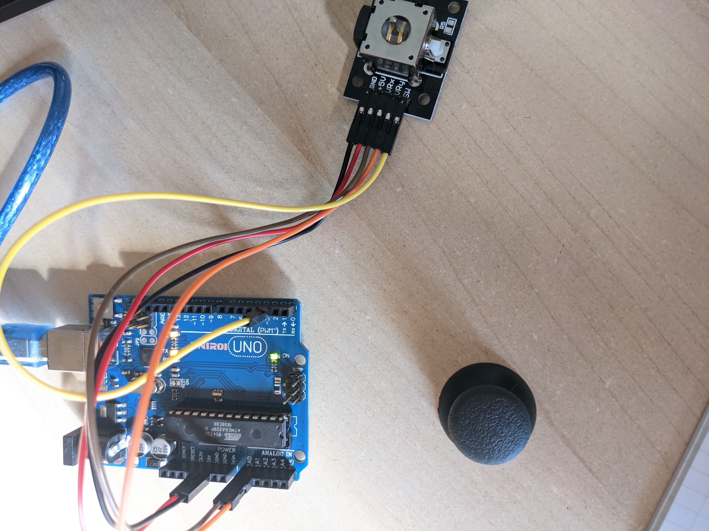
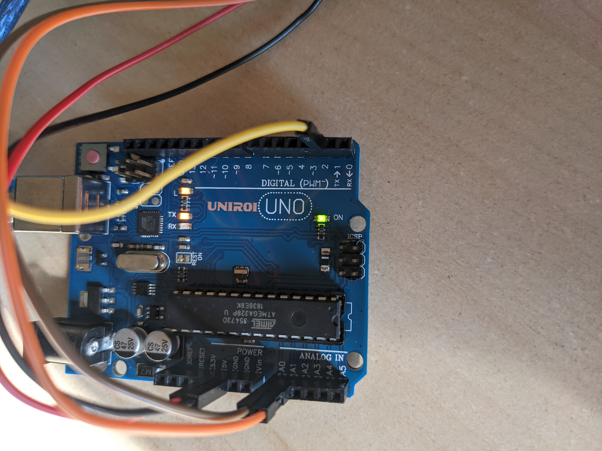
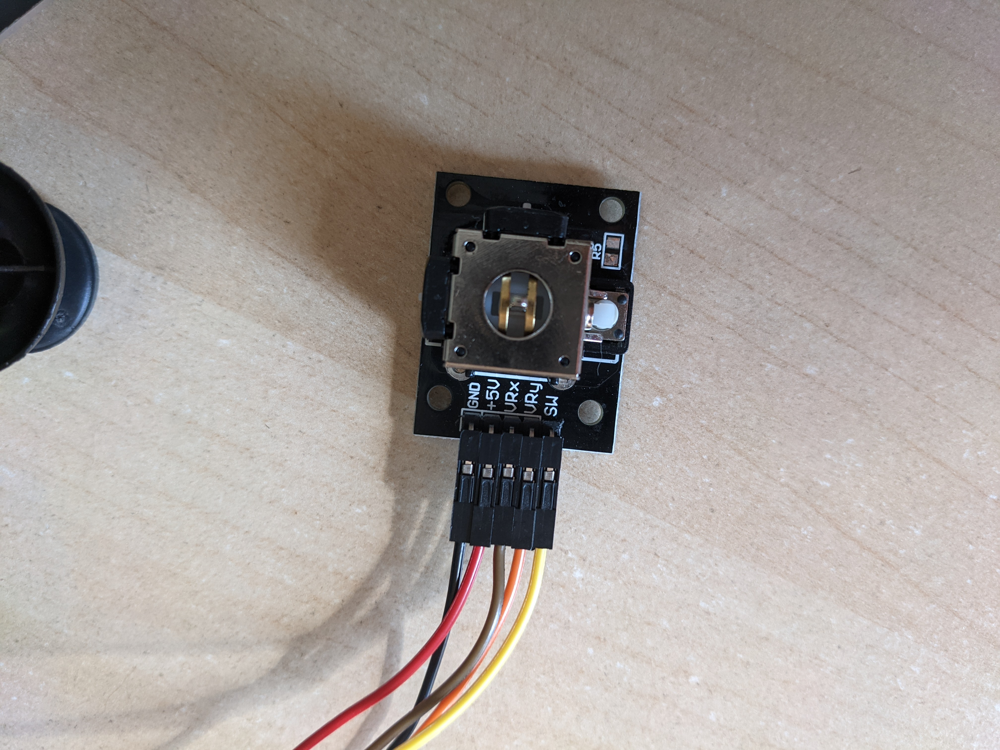

# Joystick info

The Arduino has a 10 Bit ADC, which means that it can sense 1024 different voltages,ranging from 0 to 5 volts. 
When the Joystick is resting in the middle, the Arduino should read a value of 512 (2.5 Volts). 
When the Joystick is pushed up it should read 1023 (5 Volts) and 
when pushed down it should read 0 (0 Volts). 

## X/Y-Axis values
|----------------------------------------| 
|               Y-axis                   | 
| Up = 0   | center = 512 | down = 1023  | 
|               X-axis                   | 
| Left = 0 | center = 512 | Right = 1023 | 
|                                        | 
|----------------------------------------| 
 
When playing the joystick may not be at the exact center and thus the value may not be exactly 512.
That's why in our example we check values between 0-400 and 600-1023. To avoid what we cna call "deadstick".
For most cases 5% deadstick is enough; previous values are totaly arbitrary.

## Switch (SW)
SW, is used as ON/OFF button. 0 when the joystick is pushed, 1 otherwise.

# Connexions
For HW connexions: 
 **Joystick** |  **board** 
 GND     <->  GND 
 5V      <->  5V 
 VRx     <->  A0 
 VRy     <->  A1 
 SW      <->  2 

