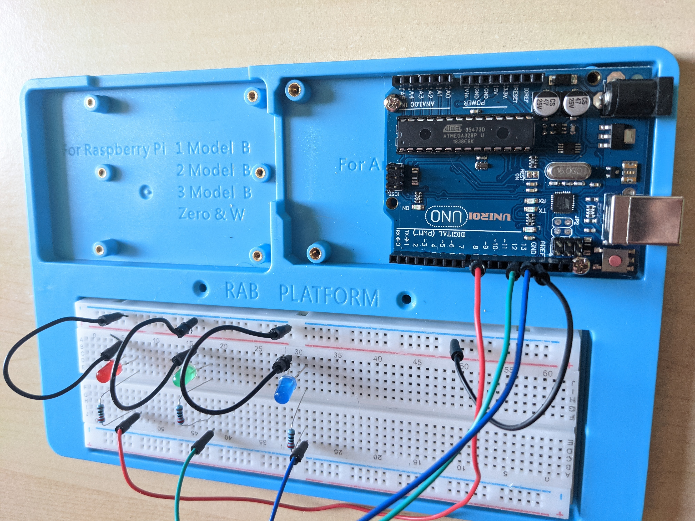
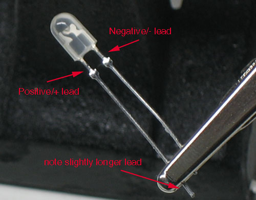

# LEDs
In this example we make blink three leds one after the others.

# Connexions
For HW connexions: 
 **LEDS** |  **board** 
 RED+    <->  GND  
 RED-    <->  13   
 GREEN+  <->  GND  
 GREEN-  <->  12   
 BLUE+   <->  GND  
 BLUE-   <->  8    

## HW info
Long branch of the led is the positive side. The negative branch is connected to a 220ohm resistance before to be plugged to the arduino board.
