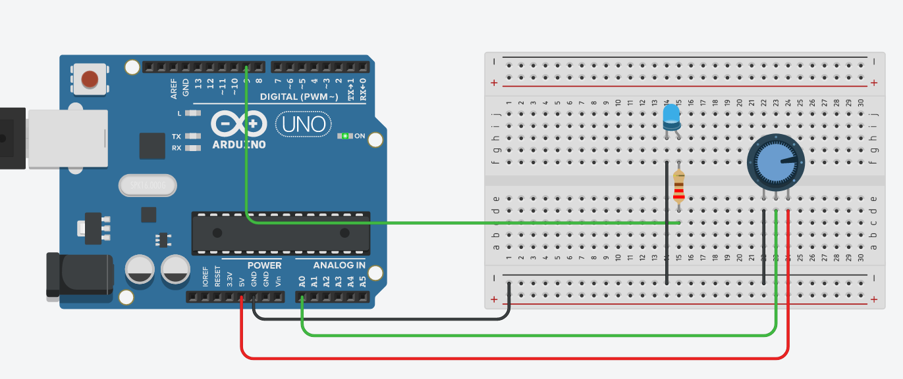
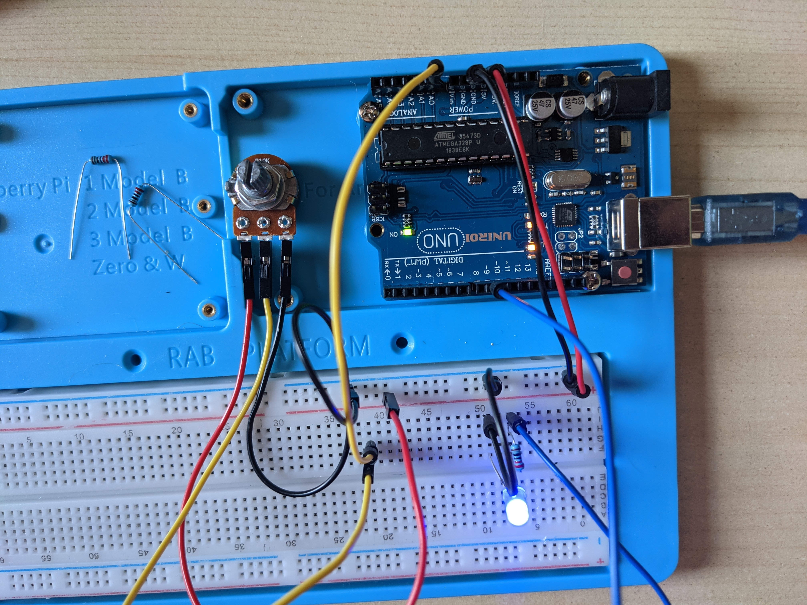

# Potentiometer + 1-LED
In this example we light a led according to the potentiometer value.

# Connexions
For HW connexions: 
 **LEDS**   |  **board** 
 LED+      <->  GND  
 LED-      <->  9    
 POT-T1    <->  GND  
 POT-Wiper <->  A0   
 POT-T2    <->  +    
 

## HW info
Long branch of the led is the positive side. The negative branch is connected to a 220ohm resistance before to be plugged to the arduino board.
