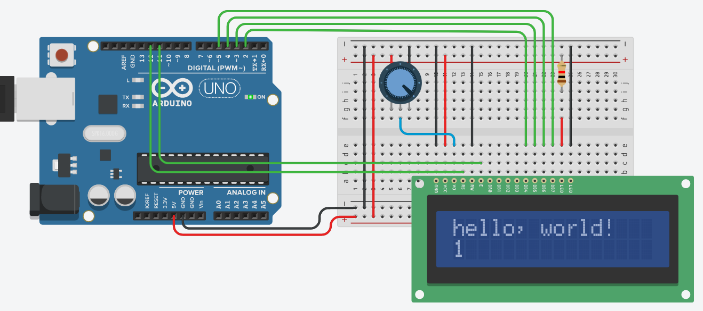

# Screen LCD info
We use a LCD screen with 16x2 characteres. 

# Connexions
For HW connexions: 
 **Screen** |  **board** 
 VSS       <->  GND  
 VDD       <->  5v   
 VO        <->  Potentiometer 
 RS        <->  12   
 RW        <->  GND  
 E         <->  11   
 D0        <->  N/A  
 D1        <->  N/A  
 D2        <->  N/A  
 D3        <->  N/A  
 D4        <->  5    
 D5        <->  4    
 D6        <->  3    
 D7        <->  2    
 A         <->  res+ 
 K         <->  GND  

## HW info
|Name| Description|
|VSS | Mass/GND|
|VDD | +5v|
|VO  | Contrast|
|RS  | Register Select: 0 to send commands (e.g. clean screen or set cursor position); 1 print text |
|RW  | Read/Write: 0 send information to screen | 1 read screen |
|E   | Enable: Set to 0 when data are send |
|D0-7|Data bits|
|A   | Backlighting anode|
|K   | backlight cathode|

RW is set to the mass because we don't read what is on the screen.
VO is plugged to the potentiometer to adjust the contrast of the screen, but it's optional.

